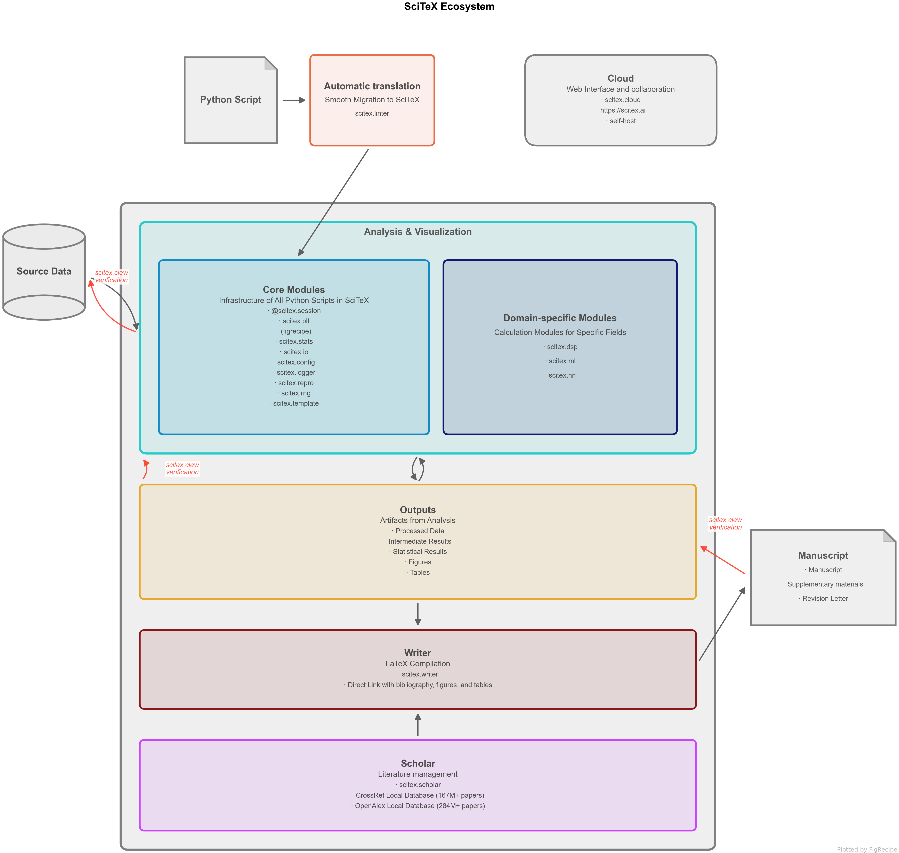
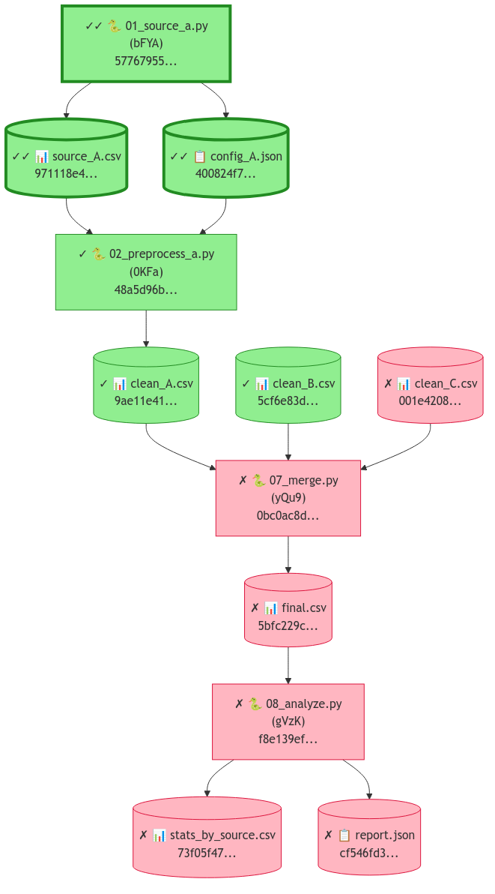

<!-- ---
!-- Timestamp: 2026-03-23 01:22:48
!-- Author: ywatanabe
!-- File: /home/ywatanabe/proj/scitex-python/README.md
!-- --- -->

# SciTeX (<code>scitex</code>)

<p align="center">
  <a href="https://scitex.ai">
    
  </a>
</p>

<p align="center"><b>Python Library for Science. For AI and Human Researchers</b></p>

<p align="center">
  <a href="https://badge.fury.io/py/scitex"></a>
  <a href="https://pypi.org/project/scitex/"></a>
  <a href="https://scitex-python.readthedocs.io"></a>
  <a href="https://github.com/ywatanabe1989/scitex-python/blob/main/LICENSE"></a>
</p>

<p align="center">
  <a href="https://scitex-python.readthedocs.io">Docs</a> &middot;
  <a href="https://scitex-python.readthedocs.io/en/latest/quickstart.html">Quick Start</a> &middot;
  <a href="https://scitex-python.readthedocs.io/en/latest/api/index.html">API</a> &middot;
  <code>pip install scitex[all]</code>
</p>

---

This repository provides `scitex`, the orchestration layer of the SciTeX ecosystem — solving key problems in scientific research:

## Problem and Solution

| # | Problem | Solution |
|---|---------|----------|
| 1 | **Fragmented tools** -- literature search, statistics, figures, and writing each require separate tools with incompatible formats | **Unified toolkit** -- `import scitex as stx` provides 50+ modules under one namespace, accessible via Python API, CLI, and MCP. These modules are standalone packages but loosely coupled through a plugin registry — each works on its own, yet composes into designed synergy (save a figure → auto-exports CSV + YAML recipe → hash-tracked by Clew → citeable in scitex-writer). |
| 2 | **No verification** -- existing tools address whether work *could* be reproduced, not whether it *has* been verified | **Cryptographic verification** -- Clew builds SHA-256 hash-chain DAGs linking every manuscript claim back to source data |
| 3 | **AI agents lack context** -- general-purpose LLMs cannot operate across the full research lifecycle without domain-specific tools | **293 MCP tools** -- AI agents run statistics, create figures, search literature, and compile manuscripts through structured tool calls |
| 4 | **No custom tooling** -- every lab needs domain-specific tools, but building and sharing them requires deep infrastructure knowledge | **App Maker and Store** -- researchers create custom apps with [scitex-app](https://github.com/ywatanabe1989/scitex-app) SDK and share via [SciTeX Cloud](https://scitex.ai) |

## SciTeX and Research Workflow

<p align="center">
    
</p>
<p align="center"><sub><b>Figure 1.</b> SciTeX research pipeline -- from literature search to manuscript compilation, with every step cryptographically linked.</sub></p>

## Demo — Automated Research from Data to Manuscript

**40 min, minimal human intervention** — an AI agent using SciTeX completed a full research cycle: literature search, statistical analysis, publication-ready figures, a 21-page manuscript, and peer review simulation. More demos are available at [https://scitex.ai/demos/](https://scitex.ai/demos/).

<p align="center">
  <a href="https://scitex.ai/demos/watch/scitex-automated-research/">
    
  </a>
</p>

## Installation

```bash
pip install scitex[all]                # Recommended: everything (may take >1 hour on first install — see Installation Tips)
```

<details>
<summary><strong>Per-module extras</strong></summary>

```bash
pip install scitex                     # Core only (minimal)
pip install scitex[plt,stats,scholar]  # Typical research setup
pip install scitex[plt]                # Publication-ready figures (figrecipe)
pip install scitex[stats]              # Statistical testing (23+ tests)
pip install scitex[scholar]            # Literature search, PDF download, BibTeX enrichment
pip install scitex[writer]             # LaTeX manuscript compilation
pip install scitex[audio]              # Text-to-speech
pip install scitex[ai]                 # LLM APIs (OpenAI, Anthropic, Google) + ML tools
pip install scitex[dataset]            # Scientific datasets (DANDI, OpenNeuro, PhysioNet)
pip install scitex[browser]            # Web automation (Playwright)
pip install scitex[capture]            # Screenshot capture and monitoring
pip install scitex[cloud]              # Cloud platform integration
```

Requires Python 3.10+. We recommend [uv](https://docs.astral.sh/uv/) for fast installs.
</details>

<details>
<summary><strong>Installation Tips — timeouts, mirrors, <code>[all]</code> size</strong></summary>

`pip install scitex[all]` pulls the full 33-package ecosystem plus heavy extras (playwright browsers, torch, jax, pymupdf, Apptainer/Docker integrations, etc.). On a typical connection it can take **30–90 minutes** — more if PyPI is slow. Common fixes:

```bash
# 1. Extend pip's socket timeout (default 15s) — stops big wheel pulls from aborting mid-stream
pip install --timeout 600 --retries 5 "scitex[all]"

# 2. Use uv — 10-30× faster resolver, far better retry behaviour
pip install uv && uv pip install "scitex[all]"

# 3. Install in groups if a single run keeps failing
pip install scitex[io,stats,plt]         # core analysis layer first
pip install scitex[scholar,writer]       # research layer
pip install scitex[audio,browser,dataset,cloud]   # heavy extras last

# 4. Mirror — for networks where pypi.org is unreliable
pip install -i https://pypi.tuna.tsinghua.edu.cn/simple "scitex[all]"
```

If a single dep hangs, identify it with `pip install -v` and install that package alone with `--no-deps`, then resume the full install.
</details>

<details>
<summary><strong>Module Overview</strong></summary>

| Category | Modules | Description |
|----------|---------|-------------|
| **Core** | `session`, `io`, `config`, `clew` | Experiment tracking, file I/O, config, cryptographic verification |
| **Analysis** | `stats`, `plt`, `dsp`, `linalg` | Statistics, plotting, signal processing, linear algebra |
| **Research** | `scholar`, `writer`, `diagram`, `canvas` | Literature, manuscripts, diagrams, figure composition |
| **ML/AI** | `ai`, `nn`, `torch`, `cv`, `benchmark` | LLM APIs, neural networks, PyTorch, computer vision |
| **Data** | `pd`, `db`, `dataset`, `schema` | Pandas utilities, databases, scientific datasets |
| **Infra** | `app`, `cloud`, `tunnel`, `container` | App SDK, cloud, SSH tunnels, containers |
| **Automation** | `browser`, `capture`, `audio`, `notification` | Web automation, screenshots, TTS, notifications |
| **Dev** | `dev`, `template`, `linter`, `introspect` | Ecosystem tools, scaffolding, code analysis |

</details>

## Packages — 3-Layer Cascade Architecture

The 33-package ecosystem follows a strict **dependency cascade**: upstream imports middle imports downstream, never the reverse. Downstream apps must work standalone; the umbrella only orchestrates.

```
Upstream (orchestration — SOC, integration tests only)
    scitex (scitex-python), scitex-cloud
        │ imports / re-exposes
        ▼
Middle (shared infrastructure — wraps, doesn't replace)
    scitex-io, scitex-stats, scitex-app, scitex-ui, scitex-audio, scitex-dev
        │ integrates / wraps via plugin registry
        ▼
Downstream (standalone apps — own IO/GUI, unit tests)
    figrecipe, scitex-writer, scitex-scholar, scitex-clew, scitex-notebook,
    scitex-dataset, scitex-tunnel, scitex-container, scitex-browser, scitex-linter,
    openalex-local, crossref-local, socialia, + utility leaves
    (scitex-{path,str,dict,logging,types,db,repro,audit,parallel,compat,gists,etc,core})
```

**One-line contract**: downstream does not know upstream exists; upstream does not duplicate downstream logic. See [07_arch-upstream-and-downstream](src/scitex/_skills/general/07_arch-upstream-and-downstream.md) for full rules (testing, cascade, interfaces) and [08_arch-dependency-and-version-pinning](src/scitex/_skills/general/08_arch-dependency-and-version-pinning.md) for dep-pinning.

## Quick Start

<details>
<summary><strong><code>@scitex.session</code> -- Reproducible Experiment Tracking</strong></summary>

One decorator gives you: auto-CLI, YAML config injection, random seed fixation, structured output, and logging.

```python
import scitex as stx
import numpy as np

@stx.session
def main(
    data_path: str = "./data.csv",   # --data-path data.csv
    n_samples: int = 100,            # --n-samples 200
    CONFIG=stx.session.INJECTED,     # Aggregated ./config/*.yaml
    plt=stx.session.INJECTED,        # Pre-configured matplotlib
    logger=stx.session.INJECTED,     # Session logger
):
    """Analyze data. Docstring becomes --help text."""
    
    # Load
    data = stx.io.load(data_path)
    
    # Demo data
    x = np.linspace(0, 2 * np.pi, n_samples)
    y = np.sin(x) + np.random.randn(n_samples) * 0.1
    
    # FigRecipe Plot
    fig, ax = stx.plt.subplots()
    ax.plot(x, y)
    ax.set_xyt("Time", "Amplitude", "Noisy Sine Wave")
    
    # Save sine.png + sine.csv with logging message
    stx.io.save(fig, "sine.png")
    
    return 0

if __name__ == "__main__":
    main()
```

```bash
$ python script.py --data-path experiment.csv --n-samples 200
$ python script.py --help
# usage: script.py [-h] [--data-path DATA_PATH] [--n-samples N_SAMPLES]
# Analyze data. Docstring becomes --help text.
```

```
script_out/FINISHED_SUCCESS/2026-03-18_14-30-00_Z5MR/
├── sine.png, sine.csv         # Figure + auto-exported plot data
├── CONFIGS/CONFIG.yaml        # Frozen parameters
└── logs/{stdout,stderr}.log   # Execution logs
```

The injected `CONFIG` is a `DotDict` merging YAML user configs with session-resolved keys:

| Key | Meaning |
|-----|---------|
| `CONFIG.ID` | Session identifier, e.g. `2026-04-23T21-30-00_Z5MR` |
| `CONFIG.PID` | Python process ID |
| `CONFIG.START_DATETIME` | When the session started |
| `CONFIG.FILE` | Path to caller script |
| `CONFIG.SDIR_OUT` | Base output dir, e.g. `analysis_out/` |
| `CONFIG.SDIR_RUN` | This run's dir, e.g. `analysis_out/FINISHED_SUCCESS/<ID>/` |
| `CONFIG.ARGS` | Parsed CLI args |
| `CONFIG.MODEL.*` | Values from `./config/MODEL.yaml` (one namespace per YAML file) |

Use `CONFIG.SDIR_RUN / "results.csv"` to re-load a file saved earlier in the same session. A frozen copy of `CONFIG` is persisted to `CONFIG.SDIR_RUN/CONFIGS/{CONFIG.yaml,CONFIG.pkl}` so any run is fully auditable. See [25_session-config](./src/scitex/_skills/general/25_session-config.md) for the full reference.
</details>


<details>
<summary><strong><code>scitex.io</code> -- Unified File I/O (50+ Formats)</strong></summary>

```python
import scitex as stx

# Save and load -- format detected from extension.
# symlink_from_cwd=True drops a symlink at cwd so round-trip by filename works;
# without it, save() routes to <script>_out/ and load() must use an absolute path.
stx.io.save(df, "results.csv", symlink_from_cwd=True)
df = stx.io.load("results.csv")

stx.io.save(arr, "data.npy", symlink_from_cwd=True)
arr = stx.io.load("data.npy")

stx.io.save(fig, "figure.png")       # Also exports figure data as CSV
stx.io.save(config, "config.yaml")
stx.io.save(model, "model.pkl")

# Aggregate ./config/*.yaml into a single DotDict
CONFIG = stx.io.load_configs(config_dir="./config")
print(CONFIG.MODEL.hidden_size)      # Dot-notation access

# Register custom formats
@stx.io.register_saver(".custom")
def save_custom(obj, path, **kw):
    with open(path, "w") as f:
        f.write(str(obj))

@stx.io.register_loader(".custom")
def load_custom(path, **kw):
    with open(path) as f:
        return f.read()
```

Supports: CSV, JSON, YAML, TOML, HDF5, NPY, NPZ, PKL, PNG, JPG, SVG, PDF, Excel, Parquet, Zarr, INI, TXT, MAT, WAV, MP3, BibTeX, and more.

**Built-in features**: Auto directory creation, path resolution to `<script_name>_out/`, symlinks (`symlink_from_cwd=True`), save logging with file size, and Clew hash tracking.
</details>

<details>
<summary><strong><code>scitex.plt</code> -- Reproducible, Restylable Figures</strong></summary>

Powered by [figrecipe](https://github.com/ywatanabe1989/figrecipe). Figures are **reproducible nodes** in the Clew verification DAG -- scientific data and visual style are decomposed, so figures can be restyled (fonts, colors, layout) without altering the underlying data hash. Every figure auto-exports its data as CSV + a YAML recipe for exact reproduction.

```python
import scitex as stx
fig, axes = stx.plt.subplots(1, 3)
axes[0].stx_line(x, y)
axes[0].set_xyt("Time", "Value", "Line")

axes[1].stx_violin([g1, g2, g3])
axes[1].set_xyt("Group", "Score", "Violin")

axes[2].stx_heatmap(corr_matrix)
axes[2].set_xyt("X", "Y", "Heatmap")
stx.io.save(fig, "analysis.png")  # Saves analysis.png + analysis.csv + analysis.yaml

# Restyle without changing data (hash stays valid for Clew verification)
stx.plt.reproduce("analysis.yaml", style="nature")
```
</details>

<details>
<summary><strong><code>scitex.stats</code> -- Publication-Ready Statistics (23+ Tests)</strong></summary>

```python
import scitex as stx
result = stx.stats.run_test("ttest_ind", group1, group2, return_as="dataframe")
# Returns: p-value, effect size (Cohen's d), CI, normality check, power
recommendations = stx.stats.recommend_tests(data)
stx.stats.annotate(ax, test=result, style="apa")   # stars + "t(58) = 2.34, p = .021, d = 0.60" on a matplotlib Axes
```
</details>

<details>
<summary><strong><code>scitex.scholar</code> -- Literature Management</strong></summary>

Search, download, enrich papers. Backed by local CrossRef (167M+) and OpenAlex (250M+) databases.

```python
import scitex as stx
scholar = stx.scholar.Scholar()                             # lazy-load library
papers = scholar.process_papers(["neural oscillations working memory"])
scholar.download_pdfs_from_dois(["10.1038/s41586-024-07804-3"])
scholar.enrich_papers(bibtex_path="references.bib")
```

```bash
scitex scholar search "neural oscillations" --n 20
scitex scholar bibtex references.bib --output enriched.bib
```
</details>

<details>
<summary><strong><code>scitex.writer</code> -- LaTeX Manuscript Compilation</strong></summary>

```python
import scitex as stx
stx.writer.compile.manuscript("paper/")                     # latexmk wrapper
stx.writer.figures.add("paper/", "results.png", caption="Main results")
stx.writer.tables.add("paper/", "stats.csv", caption="Statistical summary")
```
</details>

<details>
<summary><strong><code>scitex.notification</code> -- Multi-Backend Notifications</strong></summary>

Get notified when experiments finish -- via desktop, phone call, SMS, or email -- with automatic fallback.

```python
import scitex as stx
stx.notification.alert("Experiment complete: accuracy = 94.2%")
stx.notification.call("Training diverged -- loss is NaN")
stx.notification.sms("GPU job finished on node-42")

@stx.session(notify=True)   # Notifies on completion or failure
def main(CONFIG=stx.session.INJECTED): ...
```
</details>

<details>
<summary><strong><code>scitex.clew</code> -- Cryptographic Verification for AI-Driven Science</strong></summary>

As AI agents produce research at scale, the question shifts from *"could this be reproduced?"* to *"has this been verified?"*. Clew builds a **SHA-256 hash-chain DAG** linking every manuscript claim back to source data.

```python
import scitex as stx

# Every stx.io.load/save automatically records file hashes -- zero config
stx.clew.status()                          # {'verified': 12, 'mismatched': 0, 'missing': 0}
stx.clew.chain("results/figure1.png")      # Trace one file back to source data
stx.clew.dag(claims=True)                  # Verify all manuscript claims

# Register traceable assertions
stx.clew.add_claim(
    file_path="paper/main.tex", claim_type="statistic", line_number=142,
    claim_value="t(58) = 2.34, p = .021",
    source_session="2026-03-18_14-30-00_Z5MR", source_file="results/stats.csv",
)

stx.clew.mermaid(claims=True)              # Visualize provenance DAG
```

| Mode | Function | Answers |
|------|----------|---------|
| **Project** | `clew.dag()` | Is the whole project intact? |
| **File** | `clew.chain("output.csv")` | Can I trust this specific file? |
| **Claim** | `clew.verify_claim("Fig 1")` | Is this manuscript assertion valid? |

**L1** hash comparison (ms) / **L2** sandbox re-execution (min) / **L3** registered timestamp proof (optional).

<p align="center">
  
</p>
<p align="center"><sub><b>Figure 2.</b> Clew verification DAG -- green nodes are verified (hash match), red nodes have mismatches. Each node shows its SHA-256 hash prefix.</sub></p>

</details>

<details>
<summary><strong><code>scitex.audio</code> -- Text-to-Speech (ElevenLabs / LuxTTS / gTTS / pyttsx3)</strong></summary>

```python
import scitex as stx
stx.audio.speak("Training complete. Accuracy ninety-four percent.")
stx.audio.speak("Offline only", backend="pyttsx3")                  # force offline
stx.audio.speak("Report", output_path="report.mp3", play=False)     # TTS → file
```
Backends fall back automatically: ElevenLabs (paid, highest) → LuxTTS (offline, 48 kHz, voice-cloning) → gTTS (free online) → pyttsx3 (offline espeak).
</details>

<details>
<summary><strong><code>scitex.dataset</code> -- OpenNeuro / DANDI / PhysioNet / Zenodo Fetcher</strong></summary>

```python
import scitex as stx
ds = stx.dataset.neuroscience.openneuro.fetch_all_datasets(max_datasets=10)
stx.dataset.neuroscience.dandi.fetch_all_datasets(max_datasets=10)
hits = stx.dataset.search_datasets(ds, text_query="phase-amplitude coupling")
```
Uniform API across neuroscience / biomedical / clinical-trial repositories.
</details>

<details>
<summary><strong><code>scitex.container</code> -- Apptainer / Docker Management</strong></summary>

```python
import scitex as stx
stx.container.apptainer.build(def_name="recipe")        # versioned SIF
stx.container.apptainer.switch_version("2.19.5")        # atomic active-SIF flip
stx.container.apptainer.rollback()                      # revert to previous
snap = stx.container.env_snapshot()                     # full env for papers
```
Reproducible HPC containers — build, version, rollback, env-snapshot for manuscripts.
</details>

<details>
<summary><strong><code>scitex.tunnel</code> -- Persistent SSH Reverse Tunnels</strong></summary>

```python
import scitex as stx
stx.tunnel.setup(port=8888, bastion_server="gw.example.com")
stx.tunnel.status()                                     # {"8888": "active"}
```
NAT traversal for lab machines — autossh-backed systemd service.
</details>

<details>
<summary><strong><code>scitex.linter</code> -- 47-Rule Convention Checker</strong></summary>

```python
import scitex as stx
issues = stx.linter.lint_file("src/")
for i in issues:
    print(f"{i.filepath}:{i.line} [{i.rule.id}] {i.message}")
```
Lints SciTeX projects for ecosystem conventions (`stx.io.save` usage, CONFIGS naming, matplotlib prefs, import hygiene). Complements ruff/flake8.
</details>

<details>
<summary><strong><code>scitex.repro</code> -- Seed Everything + Array Hashing</strong></summary>

```python
import scitex as stx
rng = stx.repro.RandomStateManager(seed=42)             # seeds random + numpy + torch + tf
run_id = stx.repro.gen_ID()                             # "20260423_2155_abc12345"
digest = stx.repro.hash_array(np_array)                 # deterministic SHA
```
One call seeds every RNG; generates experiment-run IDs; hashes arrays for fingerprinting.
</details>

<details>
<summary><strong><code>scitex.parallel</code> -- Threaded Map with tqdm</strong></summary>

```python
import scitex as stx
results = stx.parallel.run(download, [(u,) for u in urls], n_jobs=-1)
```
Drop-in parallel map for I/O-bound work — HTTP fetches, file reads, API calls. tqdm progress bar built-in.
</details>

<details>
<summary><strong><code>scitex.path</code> -- Project-Aware Paths &amp; Session Dirs</strong></summary>

```python
import scitex as stx
root = stx.path.find_git_root()                     # walk up for .git/
out = stx.path.get_spath("results.csv")             # → {script}_out/results.csv
stx.path.create_relative_symlink(src, dst)          # relative (portable) symlink
latest = stx.path.find_latest(".", "model_", ".pt") # model_v003.pt (highest version)
stx.path.fix_broken_symlinks("dir/", remove=True)   # cleanup dangling links
```
Auto-routes saves to `{script}_out/` and resolves session-scoped paths so `@stx.session` scripts produce dated, hash-trackable output dirs with no boilerplate.
</details>

<details>
<summary><strong><code>scitex.logging</code> -- Extended Logging + Exception Hierarchy + Tee</strong></summary>

```python
import scitex as stx
logger = stx.logging.getLogger(__name__)
logger.success("Training converged at epoch 87")    # SUCCESS level (custom)
logger.fail("Validation loss diverged")             # FAIL level (custom)

# Structured warnings with SciTeX categories
stx.logging.warn_deprecated("old_api", replacement="new_api", version="3.0")
stx.logging.warn_data_loss("NaN values dropped in column 'bp'")

# Typed exceptions (30+ subclasses of SciTeXError)
raise stx.logging.ShapeError("expected (N, 2), got (N, 3)")

# Tee stdout/stderr to a log file
with stx.logging.Tee("run.log"):
    main()                                           # prints go to screen + file
```
Extends stdlib `logging` with SUCCESS/FAIL levels, a 30+ class exception tree (`IOError`/`ShapeError`/`ConfigKeyError`/...), structured warning categories, and tee-to-file. `SCITEX_LOGGING_LEVEL` env var sets default at import.
</details>

<details>
<summary><strong><code>scitex.db</code> -- SQLite3 / PostgreSQL with ndarray BLOB Storage</strong></summary>

```python
import scitex as stx, numpy as np

db = stx.db.SQLite3("experiments.db")
with db:                                             # context-manager transaction
    db.execute("CREATE TABLE IF NOT EXISTS runs (id TEXT, acc REAL)")
    db.save_array("weights_epoch_87", np.random.rand(1024, 1024))   # compressed BLOB

df = db.to_df("runs")                                # pandas round-trip
w = db.load_array("weights_epoch_87")                # typed ndarray back
db.check_health()                                    # integrity + schema drift
stx.db.delete_duplicates(conn, "runs", columns=["id"])
```
SQLite / PostgreSQL clients with first-class compressed-ndarray BLOBs, dataframe round-trips, health checks, and duplicate removal. Drop-in replacement for hand-rolling `pickle → BLOB` storage or SQLAlchemy Core when you don't need an ORM.
</details>

<details>
<summary><strong><code>scitex.browser</code> -- Playwright Helpers for Scientific Scraping</strong></summary>

```python
import scitex as stx, asyncio

async def grab_pdf():
    async with stx.browser.SyncBrowserSession() as session:
        page = await session.new_page()
        await page.goto("https://journal.example/article/123")
        await stx.browser.click_with_fallbacks_async(
            page, ["button.download-pdf", "a[href$='.pdf']"]   # fall through selectors
        )
        await stx.browser.save_as_pdf_async(page, "article.pdf")

asyncio.run(grab_pdf())
```
Playwright wrappers with: Chrome-PDF-viewer download helper, popup/cookie dismissers (`close_popups_async`, `PopupHandler`), cursor/click/step overlays for debug video recording, console-log collectors, test-failure artifact capture. Drop-in replacement for raw Playwright scripts + stealth plugins.
</details>

<details>
<summary><strong>Utility modules — lower-level helpers</strong></summary>

| Module | Purpose | Key API |
|--------|---------|---------|
| `stx.str` | Text / LaTeX fallback / colored prints | `printc`, `safe_latex_render`, `grep` |
| `stx.dict` | `DotDict` + safe merge / flatten | `DotDict`, `safe_merge`, `flatten` |
| `stx.types` | Union type aliases + predicates | `ArrayLike`, `ColorLike`, `is_array_like` |
| `stx.audit` | Unified security scan (bandit / shellcheck / pip-audit) | `audit()` |
| `stx.compat` | Deprecation shims | `@deprecated`, `notify` legacy alias |
| `stx.etc` | Terminal keypress helpers | `wait_key`, `count` |

See [docs/05_ADDITIONAL_MODULES.md](./docs/05_ADDITIONAL_MODULES.md) for full examples.
</details>

> **[Agentic usage](./docs/06_AGENTIC_USAGE.md)** — MCP setup, example prompts, real one-shot outputs, and skill-trigger testing.

> **[Full API reference](https://scitex-python.readthedocs.io/en/latest/api/index.html)** &middot; **[Examples](./examples/)** &middot; **[Module status](./docs/04_MODULE_STATUS.md)**

<details>
<summary><strong>CLI Commands</strong></summary>

```bash
scitex --help-recursive                  # Show all commands
scitex scholar search "topic"            # Search literature
scitex scholar fetch "10.1038/..."       # Download paper by DOI
scitex stats recommend                   # Suggest statistical tests
scitex clew status                       # Project verification overview
scitex clew dag --claims                 # Verify all manuscript claims
scitex audio speak "Analysis complete"   # Text-to-speech
scitex notification alert "Job finished" # Multi-backend notification
scitex template clone research my_proj   # Scaffold a project
scitex dev versions                      # Check ecosystem versions
scitex mcp list-tools                    # List all MCP tools (293)
```

> **[Full CLI reference](./docs/01_CLI_COMMANDS.md)**
</details>

<details>
<summary><strong>MCP Server (293 tools across 23 modules)</strong></summary>

Turn AI agents into autonomous researchers via [MCP](https://modelcontextprotocol.io/).

| Category | Tools | | Category | Tools | | Category | Tools |
|----------|-------|-|----------|-------|-|----------|-------|
| plt | 73 | | crossref | 15 | | io | 5 |
| cloud | 50 | | dev | 13 | | template | 4 |
| writer | 38 | | introspect | 12 | | openalex | 4 |
| scholar | 22 | | stats | 10 | | linter | 3 |
| clew | 9 | | dataset | 8 | | social | 3 |
| project | 6 | | notify | 5 | | tunnel | 3 |
| docs | 4 | | ui | 2 | | usage | 2 |

```json
{"mcpServers": {"scitex": {"command": "scitex", "args": ["mcp", "start"],
  "env": {"SCITEX_ENV_SRC": "${SCITEX_ENV_SRC}"}}}}
```

> **[Full MCP reference](./docs/02_MCP_TOOLS.md)**
</details>

## Configuration

```bash
cp -r .env.d.examples .env.d   # 1. Copy examples
$EDITOR .env.d/                # 2. Edit credentials
source .env.d/entry.src        # 3. Source in shell
```

> **[Full configuration reference](./.env.d.examples/README.md)**


## SciTeX Ecosystem

[`scitex-cloud`](https://github.com/ywatanabe1989/scitex-cloud) is a self-hosted web application that serves as a collaborative research workspace — with a built-in Writer, Scholar, and App Store where researchers build custom tools using [`scitex-app`](https://github.com/ywatanabe1989/scitex-app) SDK and [`scitex-ui`](https://github.com/ywatanabe1989/scitex-ui) components, then share them with the community. A live instance is hosted at [scitex.ai](https://scitex.ai).

<details>
<summary><strong>Full Ecosystem (17 packages)</strong></summary>

| Package | Module | Description |
|---------|--------|-------------|
| [scitex-clew](https://github.com/ywatanabe1989/scitex-clew) | `stx.clew` | SHA-256 hash-chain DAG for provenance |
| [scitex-io](https://github.com/ywatanabe1989/scitex-io) | `stx.io` | Unified file I/O (30+ formats) |
| [scitex-stats](https://github.com/ywatanabe1989/scitex-stats) | `stx.stats` | Publication-ready statistics |
| [figrecipe](https://github.com/ywatanabe1989/figrecipe) | `stx.plt` | Publication-ready matplotlib figures |
| [scitex-writer](https://github.com/ywatanabe1989/scitex-writer) | `stx.writer` | LaTeX manuscript compilation |
| [scitex-scholar](https://github.com/ywatanabe1989/scitex-scholar) | `stx.scholar` | Literature management |
| [scitex-notification](https://github.com/ywatanabe1989/scitex-notification) | `stx.notification` | Multi-backend notifications |
| [scitex-audio](https://github.com/ywatanabe1989/scitex-audio) | `stx.audio` | Text-to-speech and audio |
| [scitex-dev](https://github.com/ywatanabe1989/scitex-dev) | `stx.dev` | Developer tools, ecosystem management |
| [scitex-linter](https://github.com/ywatanabe1989/scitex-linter) | `stx.linter` | AST-based code pattern checking |
| [scitex-dataset](https://github.com/ywatanabe1989/scitex-dataset) | `stx.dataset` | Scientific datasets |
| [scitex-cloud](https://github.com/ywatanabe1989/scitex-cloud) | `stx.cloud` | Self-hosted research platform |
| [scitex-app](https://github.com/ywatanabe1989/scitex-app) | `stx.app` | Runtime SDK for research apps |
| [scitex-ui](https://github.com/ywatanabe1989/scitex-ui) | `stx.ui` | React/TS frontend components |
| [crossref-local](https://github.com/ywatanabe1989/crossref-local) | `stx.scholar` | Local CrossRef (167M+ papers) |
| [openalex-local](https://github.com/ywatanabe1989/openalex-local) | `stx.scholar` | Local OpenAlex (250M+ works) |
| [socialia](https://github.com/ywatanabe1989/socialia) | `stx.social` | Social media (Twitter, LinkedIn) |
</details>

>Four Freedoms for Research
>
>0. The freedom to **run** your research anywhere -- your machine, your terms.
>1. The freedom to **study** how every step works -- from raw data to final manuscript.
>2. The freedom to **redistribute** your workflows, not just your papers.
>3. The freedom to **modify** any module and share improvements with the community.
>
>AGPL-3.0 -- because research infrastructure deserves the same freedoms as the software it runs on.

---

<p align="center">
  <a href="https://star-history.com/#ywatanabe1989/scitex-python&Date">
    
  </a>
</p>

<p align="center">
  <a href="https://scitex.ai"></a>
</p>

<!-- EOF -->